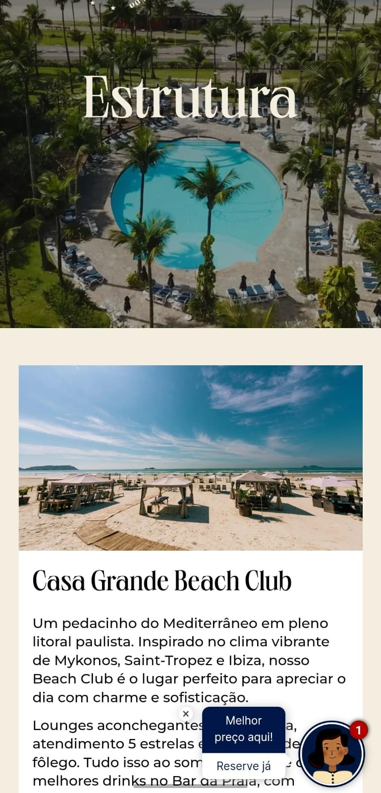
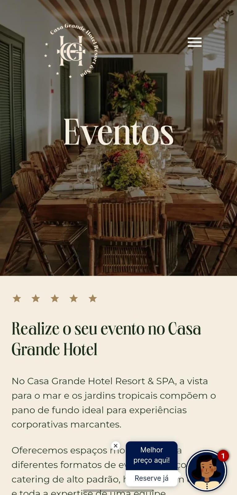

# Case de Estudo: Refatoração do Site Casa Grande Hotel & Resort
 

---

### Acesso

**Site no ar:** [casagrandehotelresort.com.br](https://casagrandehotelresort.com.br/)

### Visão Geral
Este projeto consistiu na completa refatoração e modernização do site institucional do Casa Grande Hotel & Resort. A migração foi de uma plataforma WordPress para uma aplicação totalmente nova, construída com **React e TypeScript**, com o objetivo de obter uma plataforma mais robusta, performática e de fácil manutenção.

### Nota sobre o Código-Fonte
Por se tratar de um projeto comercial desenvolvido para um cliente, o código-fonte é de sua propriedade intelectual e não pode ser compartilhado publicamente. Este repositório serve como um "case de estudo" para demonstrar a arquitetura, as tecnologias utilizadas e as funcionalidades que implementei.

### Funcionalidades de Destaque
* **Arquitetura de Componentes Dinâmicos:** Implementei uma arquitetura de componentes reutilizáveis e "data-driven". Componentes complexos como carrosséis e sistemas de abas foram projetados para renderizar conteúdo dinamicamente a partir de uma fonte de dados centralizada, garantindo consistência e escalabilidade.
* **Formulários Complexos:** Desenvolvi múltiplos formulários para diferentes fins, como reservas e contato para eventos, garantindo a validação e a usabilidade.
* **Suporte a Múltiplos Idiomas:** Contribuí para a implementação da funcionalidade de troca de idiomas, um requisito essencial para o público internacional do hotel.

### Tecnologias Utilizadas

### Meu Papel e Contribuições
Apesar de ser um projeto colaborativo, fui o principal desenvolvedor responsável por aproximadamente 80% do frontend. Minhas principais contribuições foram na **arquitetura da componentização**, no **desenvolvimento da grande maioria das mais de 20 páginas** e na garantia de que o **design fosse implementado com fidelidade e total responsividade**.

### Desafios e Aprendizados
Como meu primeiro projeto React de grande escala, foi uma oportunidade imersiva e de grande aprendizado. O principal desafio foi dominar o **gerenciamento de estado em uma aplicação complexa**, garantindo que componentes como os formulários de reserva e os carrosséis interagissem de forma coesa e performática.

Este projeto solidificou minhas habilidades em arquitetar aplicações React robustas, organizadas e escaláveis, prontas para um ambiente de produção exigente.

### Demonstração

**Versão Desktop**

**Versão Mobile**

<table align="left" border="0" cellpadding="0" cellspacing="0">
  <tr>
    <td>
      
    </td>
    <td>
      
    </td>
  </tr>
</table>
